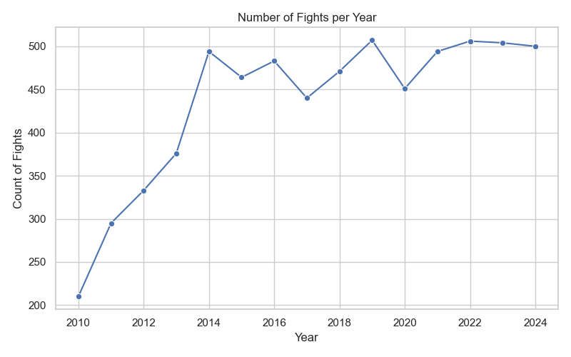

# UFC Fight Data Analysis


## Team members
* Isaac Jones, Zekai Li

## Project Description
* UFC fight analysis
* ufc-master.csv for data
* run the python script `main.py` for analysis
* CMD will print stats
* Plots folder will be created and populated with graphs
* output csv file containing statistics grouped by fighter
## Project Structure
```
UFC-Analysis
├── main.py   # Run this file for analysis 
├── analysis_utils.py
├── modeling_utils.py
├── stats_utils.py
├── ufc-master.csv  #the Dataset we used
├── fighter_stats_cleaned.csv
├── README.md
├── UFC Fight Data Analysis.pdf 
├── plots/
│   ├── advantage_by_weightclass.png
│   ├── age_analysis.png
│   ├── experience_analysis.png
│   ├── fight_count_by_year.png
│   ├── finish_ratios.png
│   ├── gender_all_Age_boxplot.png
│   ├── gender_all_Height_boxplot.png
│   ├── gender_all_Reach_boxplot.png
│   ├── gender_all_Wins_boxplot.png
│   ├── heavyweight_gap_bins.png
│   ├── roc_KNN.png
│   ├── roc_LogisticRegression.png
│   ├── roc_RandomForest.png
│   ├── round_distribution.png
│   ├── stance_analysis_vertical.png
│   └── win_method_distribution.png
```
Plots 





